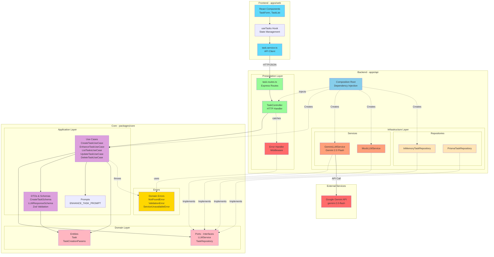

# 🚀 AI-Enhanced Todo Manager

A production-ready task management system showcasing **Clean Architecture** principles with **AI-powered task enhancement** using Google's Gemini 2.0 Flash.

## 📋 Table of Contents

- [Architecture Overview](#-architecture-overview)
- [Why Clean Architecture?](#-why-clean-architecture)
- [Tech Stack](#-tech-stack)
- [Project Structure](#-project-structure)
- [Getting Started](#-getting-started)
- [Running with Mock vs Real AI](#-running-with-mock-vs-real-ai)
- [Key Features](#-key-features)
- [Testing](#-testing)
- [Design Decisions](#-design-decisions)

---

## 🏗️ Architecture Overview

This project implements **Clean Architecture** (Uncle Bob) with clear separation of concerns across multiple layers:



### Layer Breakdown

| Layer | Responsibility | Location |
|-------|---------------|----------|
| **Domain** | Pure business logic, entities, interfaces | `packages/core/src/domain` |
| **Application** | Use cases, DTOs, orchestration | `packages/core/src/application` |
| **Errors** | Domain errors, custom exceptions | `packages/core/src/errors` |
| **Infrastructure** | External services, databases, APIs | `apps/api/src/infrastructure` |
| **Presentation** | HTTP layer, routes, controllers, error middleware | `apps/api/src/presentation` |
| **UI** | React components, hooks | `apps/web/src` |

---

## 🎯 Why Clean Architecture?

### 1. **Testability**
- Business logic isolated from frameworks and libraries
- Mock dependencies easily via interfaces
- Unit tests without external dependencies

### 2. **Flexibility**
- Swap implementations without touching business logic
- Example: `MockLLMService` ↔ `GeminiLLMService` with zero use case changes
- Repository pattern allows switching from in-memory to Prisma seamlessly

### 3. **Maintainability**
- Clear boundaries between layers
- Dependencies point inward (Dependency Rule)
- Changes in UI don't affect business logic

### 4. **Scalability**
- Monorepo structure allows independent deployment
- Core package shared between API and potential future services
- Easy to add new adapters or use cases

### 5. **Framework Independence**
- Business logic doesn't depend on Express, React, or any framework
- Can migrate to Fastify, Next.js, etc. without rewriting core logic

---

## 🛠️ Tech Stack

### Core
- **TypeScript** - Type safety across the stack
- **Zod** - Runtime validation and type inference
- **Vitest** - Fast unit testing

### Backend
- **Express** - HTTP server
- **Google Generative AI SDK** - Gemini integration
- **Prisma** - ORM (configured, using in-memory for demo)

### Frontend
- **React 18** - UI library
- **Vite** - Build tool
- **Lucide React** - Icon library

---

## 📁 Project Structure

```
.
├── apps/
│   ├── api/                    # Backend application
│   │   └── src/
│   │       ├── infrastructure/ # External implementations
│   │       │   ├── repositories/
│   │       │   │   ├── in-memory-task.repository.ts
│   │       │   │   └── prisma-task.repository.ts
│   │       │   └── services/
│   │       │       ├── gemini-llm.service.ts
│   │       │       └── mock-llm.service.ts
│   │       ├── presentation/   # HTTP layer
│   │       │   ├── controllers/
│   │       │   ├── routes/
│   │       │   └── middlewares/
│   │       │       └── error-handler.ts
│   │       ├── config/
│   │       │   └── composition-root.ts  # DI container
│   │       └── server.ts
│   │
│   └── web/                    # Frontend application
│       └── src/
│           ├── components/     # React components
│           ├── hooks/          # Custom hooks
│           └── services/       # API client
│
└── packages/
    └── core/                   # Shared business logic
        └── src/
            ├── domain/         # Pure domain layer
            │   ├── entities/
            │   └── ports/      # Interfaces
            ├── application/    # Application layer
            │   ├── dtos/       # Data Transfer Objects
            │   ├── use-cases/  # Business operations
            │   └── prompts/    # AI prompt templates
            └── errors/         # Domain errors
                └── domain-errors.ts
```

---

## 🚀 Getting Started

### Prerequisites
- Node.js 18+
- npm or yarn

### Installation

```bash
# Install dependencies
npm install

# Run both frontend and backend
npm run dev
```

The application will start:
- **Backend**: http://localhost:3000
- **Frontend**: http://localhost:5173

---

## 🤖 Running with Mock vs Real AI

### Option 1: Mock Mode (No API Key Required)

By default, the system uses `MockLLMService` which simulates AI responses.

**How it works:**
1. No `.env` file or `GEMINI_API_KEY` needed
2. Returns predefined mock data instantly
3. Perfect for development and testing

**You'll see:**
```bash
GEMINI_API_KEY not found, using MockLLMService
Server running at http://localhost:3000
```

### Option 2: Real Gemini AI

To use Google's Gemini 2.0 Flash:

1. **Get API Key:**
   - Visit [Google AI Studio](https://makersuite.google.com/app/apikey)
   - Create a new API key

2. **Configure:**
   ```bash
   # Create .env in apps/api/
   echo "GEMINI_API_KEY=your-api-key-here" > apps/api/.env
   ```

3. **Restart server:**
   ```bash
   npm run dev
   ```

**You'll see:**
```bash
Using GeminiLLMService
Server running at http://localhost:3000
```

### How the Switch Works (Dependency Injection)

```typescript
// apps/api/src/config/composition-root.ts
const apiKey = process.env.GEMINI_API_KEY;
const llmService = apiKey 
  ? new GeminiLLMService(apiKey)   // Real AI
  : new MockLLMService();           // Mock
```

**Key Point:** The use cases don't know or care which implementation is used - they only depend on the `LLMService` interface!

---

## ✨ Key Features

### 1. AI-Powered Task Enhancement
- Click "enhance" icon on any task
- AI generates:
  - Concise summary
  - Step-by-step action items
  - Risk assessment
  - Time estimation

### 2. Real-time Validation
- Zod schemas validate API requests/responses
- Type-safe contracts between frontend and backend
- Runtime validation ensures data integrity

### 3. Responsive Design
- Modern glassmorphism UI
- Smooth animations
- Mobile-friendly

### 4. Clean Separation of Concerns
- Service layer for API calls
- Custom hooks for state management
- Components focus on presentation

---

## 🧪 Testing

### Run Tests
```bash
# All tests
npm test

# Core package only
npm test -w packages/core

# Specific test file
npm test -w packages/core -- src/application/dtos/llm-response.schema.spec.ts
```

### Test Coverage
- ✅ Zod schema validation
- ✅ Use case logic (with mocks)
- ✅ Domain entities

**Example Test:**
```typescript
describe('LLMResponseSchema', () => {
  it('validates correct AI response', () => {
    const response = {
      summary: 'Build feature X',
      steps: ['Step 1', 'Step 2'],
      risks: ['Risk 1'],
      estimateHours: 5
    };
    
    expect(LLMResponseSchema.safeParse(response).success).toBe(true);
  });
});
```

---

## 🎨 Design Decisions

### 1. Monorepo Structure
**Why:** Share `@todo/core` between API and future services without duplication.

### 2. Generic `generateJson<T>` Method

```typescript
interface LLMService {
  generateJson<T>(prompt: string, schema: ZodType<T>): Promise<T>;
}
```

**Why:** 
- Domain-agnostic - can generate any JSON structure
- Future features (e.g., "generate test cases") need zero interface changes
- Schema validation built-in

### 3. Composition Root Pattern
**Why:**
- Single place for dependency wiring
- No service locator anti-pattern
- Easy to see the entire dependency graph
- Testability - inject mocks easily

### 4. Zod for Validation
**Why:**
- Type inference from schemas
- Runtime validation
- Same schema for frontend and backend
- Better than class-validator for DTOs

### 5. Separate Service Layer in Frontend
**Why:**
- Hooks manage React state
- Services handle HTTP calls
- Services are framework-agnostic (can reuse in Next.js)
- Easier to test

### 6. Error Handling with Middleware Pattern
**Why:**
- Centralized error handling in Express middleware
- Custom domain errors (`NotFoundError`, `ValidationError`, `ServiceUnavailableError`)
- Errors are part of domain language - live in `@todo/core`
- Separation of concerns - controllers don't handle error formatting

---

## 🚨 Error Handling & Validation

This application implements **production-grade error handling** following Express best practices.

### Custom Domain Errors

Located in `packages/core/src/errors/domain-errors.ts`:

```typescript
class DomainError extends Error {
  constructor(message: string, readonly statusCode: number)
}

class NotFoundError extends DomainError        // 404
class ValidationError extends DomainError       // 400
class ServiceUnavailableError extends DomainError // 503
```

**Why in Core?** Errors are part of your domain language and should be shared across all applications.

### Error Flow

```
Controller → throws DomainError
    ↓
Express next(error)
    ↓
Error Handler Middleware
    ↓
Formatted JSON Response
```

### Example Usage

**In Use Case:**
```typescript
if (!task) {
  throw new NotFoundError(`Task with id ${id} not found`);
}
```

**In Controller:**
```typescript
try {
  const task = await this.enhanceTaskUseCase.execute(id);
  res.json(task);
} catch (error) {
  next(error);  // Middleware handles it
}
```

**Error Response:**
```json
{
  "error": "NotFoundError",
  "message": "Task with id xyz not found"
}
```

### Validation Errors

Zod validation errors are automatically formatted:

```json
{
  "error": "Validation Error",
  "message": "Invalid request data",
  "details": [
    {
      "field": "title",
      "message": "Title must be less than 200 characters"
    }
  ]
}
```

### HTTP Status Codes

| Code | Error Type | Usage |
|------|-----------|--------|
| 400 | ValidationError | Invalid input data |
| 404 | NotFoundError | Resource not found |
| 500 | Internal Error | Unexpected errors |
| 503 | ServiceUnavailableError | AI/External service down |

### Benefits

✅ **Type-Safe** - TypeScript knows error types  
✅ **Reusable** - Errors shared across packages  
✅ **Maintainable** - Single place to change error handling  
✅ **Testable** - Easy to mock and test  
✅ **Professional** - Follows Express best practices  

---

**Built with ❤️ using Clean Architecture principles**
